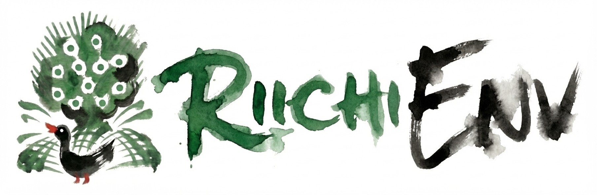

<div align="center">


<br />
<br />

[](https://github.com/smly/RiichiEnv/actions/workflows/ci.yml)
[](https://colab.research.google.com/github/smly/RiichiEnv/demos/replay_demo.ipynb)
[](https://kaggle.com/kernels/welcome?src=https://github.com/smly/RiichiEnv/demos/replay_demo.ipynb)


</div>

-----

**High-Performance Research Environment for Riichi Mahjong**

> [!NOTE]
> This project is currently under active development. The API and specifications are subject to change before the stable release.

## ✨ Features

* **High Performance**: Core logic implemented in Rust for lightning-fast state transitions and rollouts.
* **Gym-style API**: Intuitive interface designed specifically for reinforcement learning.
* **Mortal Compatibility**: Seamlessly interface with the Mortal Bot using the standard MJAI protocol.
* **Rule Flexibility**: Support for diverse rule sets, including no-red-dragon variants and three-player mahjong.
* **Game Visualization**: Integrated replay viewer for Jupyter Notebooks.

## 📦 Installation

```bash
uv add riichienv
# Or
pip install riichienv
```

Currently, building from source requires the **Rust** toolchain.

```bash
uv sync --dev
uv run maturin develop --release
```

## 🚀 Usage

### Gym-style API

```python
from riichienv import RiichiEnv
from riichienv.agents import RandomAgent

agent = RandomAgent()
env = RiichiEnv()
obs_dict = env.reset()
while not env.done():
    actions = {player_id: agent.act(obs)
               for player_id, obs in obs_dict.items()}
    obs_dict = env.step(actions)

scores, points, ranks = env.scores(), env.points(), env.ranks()
print(scores, points, ranks)
```

`env.reset()` initializes the game state and returns the initial observations. The returned `obs_dict` maps each active player ID to their respective `Observation` object.

```python
>>> from riichienv import RiichiEnv
>>> env = RiichiEnv()
>>> obs_dict = env.reset()
>>> obs_dict
{0: <riichienv._riichienv.Observation object at 0x7fae7e52b6e0>}
```

Use `env.done()` to check if the game has concluded.

```python
>>> env.done()
False
```

By default, the environment runs a single round (kyoku). For game rules supporting sudden death or standard match formats like East-only or Half-round, the environment continues until the game-end conditions are met.

### Observation

The `Observation` object provides all relevant information to a player, including the current game state and available legal actions.

`obs.new_events() -> list[str]` returns a list of new events since the last step, encoded as JSON strings in the MJAI protocol. The full history of events is accessible via `obs.events`.

```python
>>> obs = obs_dict[0]
>>> obs.new_events()
['{"id":0,"type":"start_game"}', '{"bakaze":"E","dora_marker":"S", ...}', '{"actor":0,"pai":"6p","type":"tsumo"}']
```

`obs.legal_actions() -> list[Action]` provides the list of all valid moves the player can make.

```python
>>> obs.legal_actions()
[Action(action_type=Discard, tile=Some(1), ...), ...]
```

If your agent communicates via the MJAI protocol, you can easily map an MJAI response to a valid `Action` object using `obs.select_action_from_mjai()`.

```python
>>> obs.select_action_from_mjai({"type":"dahai","pai":"1m","tsumogiri":False,"actor":0})
Action(action_type=Discard, tile=Some(1), consume_tiles=[])
```

### Supported Game Rules

Switch between different rule sets using the `game_type` keyword argument in the constructor.

> [!NOTE]
> We plan to provide 12 standard preset rule sets. In the future, we will also allow granular customization (e.g., enabling/disabling red dragons, sudden death, 1-han minimum, etc.).

| Rule Set | Players | Duration | Red Dragons | Status |
|----------|---------|----------|-------------|--------|
| `4p-red-single` | 4 | Single | Enabled | ✅ Ready (Default) |
| `4p-red-half` | 4 | Hanchan | Enabled | ✅ Ready |
| `4p-red-east` | 4 | East | Enabled | ✅ Ready |
| `3p-red-single` | 3 | Single | Enabled | 🚧 In progress |
| `3p-red-half` | 3 | Hanchan | Enabled | 🚧 In progress |
| `3p-red-east` | 3 | East | Enabled | 🚧 In progress |

Single round modes like `4p-red-single` do not feature sudden death, and allow you to specify the score situation, wind direction, number of deposit sticks, and other settings.

Example of initializing a four-player half-round game with red dragons:

```python
from riichienv import RiichiEnv
from riichienv.agents import RandomAgent

agent = RandomAgent()
env = RiichiEnv(game_type="4p-red-half")
obs_dict = env.reset()
while not env.done():
    actions = {player_id: agent.act(obs)
               for player_id, obs in obs_dict.items()}
    obs_dict = env.step(actions)

scores, points, ranks = env.scores(), env.points(), env.ranks()
print(scores, points, ranks)
```

### Compatibility with Mortal

RiichiEnv is fully compatible with the Mortal MJAI bot processing flow. I have confirmed that MortalAgent can execute matches without errors in over 1,000,000+ hanchan games on RiichiEnv.

```python
from riichienv import RiichiEnv, Action
from model import load_model

class MortalAgent:
    def __init__(self, player_id: int):
        self.player_id = player_id
        # Initialize your libriichi.mjai.Bot or equivalent
        self.model = load_model(player_id, "./mortal_v4.pth")

    def act(self, obs) -> Action:
        resp = None
        for event in obs.new_events():
            resp = self.model.react(event)

        action = obs.select_action_from_mjai(resp)
        assert action is not None, "Mortal must return a legal action"
        return action

env = RiichiEnv(game_type="4p-red-half")
agents = {pid: MortalAgent(pid) for pid in range(4)}
obs_dict = env.reset()
while not env.done():
    actions = {pid: agents[pid].act(obs) for pid, obs in obs_dict.items()}
    obs_dict = env.step(actions)

print(env.scores(), env.points(), env.ranks())
```

### Agari Calculation

```python
>>> from riichienv import AgariCalculator
>>> import riichienv.convert as cvt

>>> ac = AgariCalculator.hand_from_text("111m33p12s111666z")
>>> ac.is_tenpai()
True
>>> ac.calc(cvt.mpsz_to_tid("3s"))
Agari(agari=True, yakuman=False, ron_agari=12000, tsumo_agari_oya=0, tsumo_agari_ko=0, yaku=[8, 11, 10, 22], han=5, fu=60)
```

### Tile Conversion & Hand Parsing

Standardize between various tile formats (136-tile, MPSZ, MJAI) and easily parse hand strings.

```python
>>> import riichienv.convert as cvt
>>> cvt.mpsz_to_tid("1z")
108

>>> from riichienv import parse_hand
>>> parse_hand("123m406m789m777z")
([0, 4, 8, 12, 16, 20, 24, 28, 32, 132, 133, 134], [])

```

See [DATA_REPRESENTATION.md](docs/DATA_REPRESENTATION.md) for more details.

## 🛠 Development

For more architectural details and contribution guidelines, see [CONTRIBUTING.md](CONTRIBUTING.md) and [DEVELOPMENT_GUIDE.md](docs/DEVELOPMENT_GUIDE.md).

## Further Development Plan

- [ ] Add performance benchmarks compared to other packages.
- [ ] Add support for more game rules.
- [ ] Add example codes for training agents.
- [ ] Add high-level mahjong domain API for training agents.
- [ ] Optimize training performance (e.g., `skip_mjai_logging`, `batch_act`, etc.).
- [ ] Add interface for batch training.
- [ ] Add arena mode for evaluating agents.

## 📄 License

Apache License 2.0
